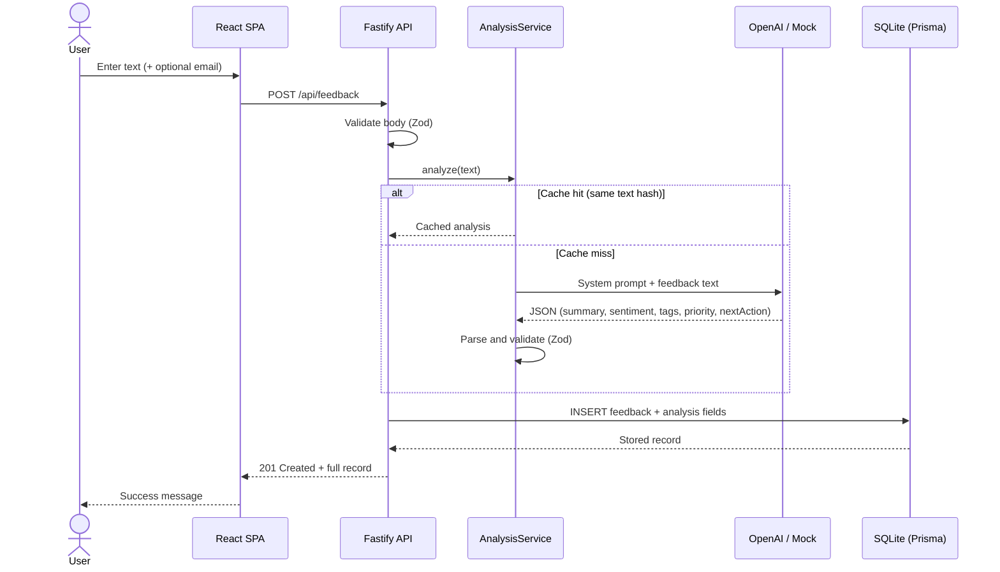
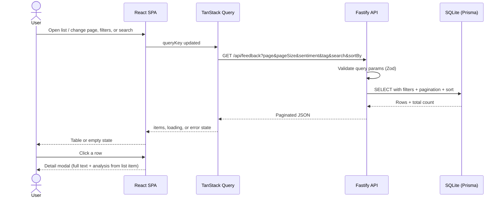

# Solution Design Document

## Architecture overview

```
┌─────────────┐     REST /api      ┌──────────────────────────────────────┐
│  React SPA  │ ◄────────────────► │  Fastify API                         │
│  (Vite)     │                    │  ├── middleware (requestId, logging) │
└─────────────┘                    │  ├── routes/feedback                 │
                                   │  ├── services/analysis (multi-provider)│
                                   │  └── repositories/feedback (Prisma)  │
                                   └──────────────────┬───────────────────┘
                                                      │
                                              ┌───────▼───────┐
                                              │ SQLite (Prisma)│
                                              └───────────────┘
```

### Sequence diagrams

The diagrams below show the main request/response paths between the browser, API, AI provider, and database.

#### Submit feedback

When a user submits feedback, analysis runs **synchronously** in the same request before the record is saved.



#### List and filter feedback

The list page loads data from the API on mount and refetches when filters, search, sort, or page change. Row clicks open a detail modal using data already in the list (no extra fetch).



**In short:**

- **Submit:** UI → API → (cache or AI) → DB → response with analysis embedded.
- **List:** UI → TanStack Query → API → DB → table; optional filters/search are applied on the server.

## Technology stack choices


| Choice                    | Rationale                                                                              |
| ------------------------- | -------------------------------------------------------------------------------------- |
| **Fastify**               | Lightweight, fast, plugin-based middleware; good fit for a focused REST API            |
| **Prisma + SQLite**       | Type-safe ORM, zero Docker setup, relational model; swap to Postgres via`DATABASE_URL` |
| **OpenAI** (`openai` SDK) | Default provider;`gpt-4o-mini`; `response_format: json_object`                         |
| **Zod**                   | Shared validation for HTTP bodies and AI output                                        |
| **React + Vite**          | Fast dev experience, component-oriented UI                                             |
| **TanStack Query**        | Server-state management with loading/error/refetch for list filters                    |
| **Vitest**                | Single test runner for API and frontend                                                |
| **pino**                  | Structured JSON logging with correlation IDs                                           |

### AI provider selection

Default provider is **OpenAI** (`gpt-4o-mini`). Set `AI_PROVIDER` to `openai`, `gemini`, or `anthropic` with the matching API key. **OpenAI and Anthropic** satisfy the assignment’s required TypeScript SDKs. **Gemini** remains available for alternate keys or free-tier dev. Use `AI_MOCK_MODE=true` for deterministic offline demos.

### Relational vs non-relational

**SQLite (relational)** was chosen because:

- The feedback model is tabular with fixed analysis fields
- Filters on `sentiment` and pagination map naturally to SQL indexes
- Prisma migrations support evolving to PostgreSQL without code changes

MongoDB/Firebase would add flexibility we do not need for a single-entity app.

## AI prompt engineering and safety

- **System prompt** instructs concise professional output and explicit JSON schema
- **PII handling:** prompt tells the model not to echo emails or personal identifiers; email is stored but not sent to the model in a separate field (only feedback text is analyzed)
- **Validation:** Zod schema enforces enum values, tag count (1–5), and string length limits
- **Malformed responses:** invalid JSON or failed validation returns `502 AI_ANALYSIS_FAILED`
- **Mock mode:** deterministic output from text hash when `AI_MOCK_MODE=true` or no API key

## Caching (chosen resilience strategy)

**In-memory hash cache** keyed by SHA-256 of normalized feedback text.


| Why cache                                            | Why not retries (for this exercise)                |
| ---------------------------------------------------- | -------------------------------------------------- |
| Duplicate submissions are common in feedback systems | Retries are harder to demonstrate and test quickly |
| Instant response on cache hit                        | Backoff adds latency to POST                       |
| Easy to unit test (verify SDK called once)           | Better suited as a complement in production        |

**Production evolution:** Redis with TTL; cache key could include model version.

## Async AI processing (production evolution)

Current: synchronous analysis inside `POST /api/feedback`.

Production approach:

1. `POST` creates record with `status: pending`, returns `202` + `id`
2. Enqueue job (BullMQ, SQS, or similar)
3. Worker calls OpenAI, updates record to `analyzed` or `failed`
4. Client polls `GET /api/feedback/:id` or receives webhook/SSE

Benefits: faster API response, retry isolation, rate-limit handling without blocking users.

## Logging

Structured **pino** logs with per-request child loggers (`requestId` on every line). Key events:

- `request_start` / `request_complete` — HTTP lifecycle
- `validation_failed` — field paths only, no body content
- `analysis_start` / `analysis_cache_hit` / `analysis_complete` / `analysis_failed` — provider, model, duration; `textLength` only (never raw feedback text)
- `db_create` / `db_list` / `db_find_by_id` — durations and counts
- `feedback_created` — record id only

Development uses `pino-pretty` when `NODE_ENV=development`. Set `LOG_LEVEL=debug` for more detail.

## Testing strategy


| Area               | Tests                         | Scenarios                                              |
| ------------------ | ----------------------------- | ------------------------------------------------------ |
| Analysis utils     | `analysis.utils.test.ts`      | JSON parse, hash, mock, Zod validation                 |
| Analysis service   | `analysis.service.test.ts`    | Mock, Gemini, OpenAI, Anthropic, cache, malformed JSON |
| Config             | `config.test.ts`              | `hasAiCredentials` per provider                        |
| Schemas            | `schemas.feedback.test.ts`    | Request/query/analysis validation                      |
| Repository helpers | `feedback.repository.test.ts` | `parseTags`, `toRecord`                                |
| Feedback routes    | `feedback.routes.test.ts`     | POST success, POST 400, GET list, GET 404              |
| Badge / TagList    | component tests               | Rendering and variants                                 |
| API client         | `client.test.ts`              | URLs, errors                                           |
| List page          | `FeedbackListPage.test.tsx`   | Sentiment filter refetch                               |
| Submit form        | `SubmitPage.test.tsx`         | Submit success, error display                          |

## Operational runbook

### AI rate limit or timeout errors

1. Check structured logs for `event: analysis_failed` and `requestId`
2. Correlate with client `x-request-id` response header
3. Verify API key for active `AI_PROVIDER` (gemini, openai, or anthropic) and quota
4. Short-term: enable `AI_MOCK_MODE=true` to unblock demos
5. Long-term: async queue with exponential backoff; circuit breaker; fallback priority rules

### Database connection exhaustion or connectivity issues

1. Check `/health` endpoint
2. Inspect logs for Prisma connection errors
3. Verify `DATABASE_URL` path and file permissions (SQLite)
4. For Postgres: check pool size (`connection_limit`), idle timeout, and max connections on the instance
5. Restart API; run `npx prisma migrate deploy` if schema drift suspected

### General debugging

- Every response error includes `requestId` — grep logs: `requestId:"<uuid>"`
- Request completion logs include `method`, `path`, `statusCode`, `durationMs`
- AI logs include `model` and `durationMs` but never raw user text

## Optional: free-text search

Implemented via `search` query param using SQLite `contains` on `text` and `summary`, with a **Search** field on the feedback list page (server-side filter, resets to page 1).

**Trade-off:** simple `LIKE`/contains works for small datasets; at scale, use Postgres full-text search (`tsvector`) or Elasticsearch for relevance ranking and performance.
